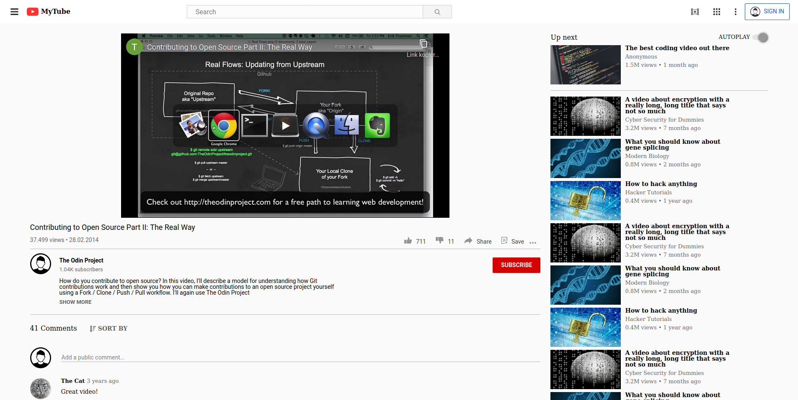

# Embedding video

The first project on the HTML/CSS curriculum at [The Odin Project](https://www.theodinproject.com). It is about embedding a youtube video in a page and styling it to look roughly similar to youtube.

## Reflection

I learned a lot doing this project.

- Prior to this, I very often assigned ID's to an element and styled it via the ID. This is not optimal because ID's have high specificity and relying heavily on them therefore limits your options to overwrite styles.
- In this project I tried to apply my styles using lower specificity, using mainly element and class selectors. I quickly ran into problems because the styles that fit one specific element were unwanted on the same element in another section of the page. Combinator selectors help a bit with this, but nevertheless the stylesheet soon becomes quite bloated and it gets more and more difficult to stay on top of which rule overwrites which other rule.
- Better planning would have helped much: take a closer look at the page you're copying and think about which common styles apply to which parts of the page.
- I found it very helpful to define utility-classes and apply them where needed. Generally I think it now best to use element selectors only for really basic stuff that should be the same for nearly every instance of the given element and use (utility) classes for the majority of the other stuff.
- For future projects it will be very helpful to think and plan first what kind of "building blocks" I want/need for my page (different kinds of headings, something like primary text, secondary text etc.)

## Demo

[View it here](https://reinimax.github.io/embedding-video/)
